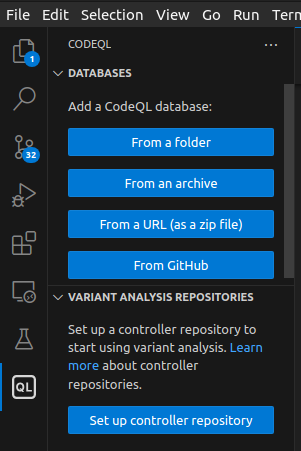
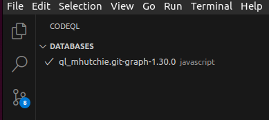
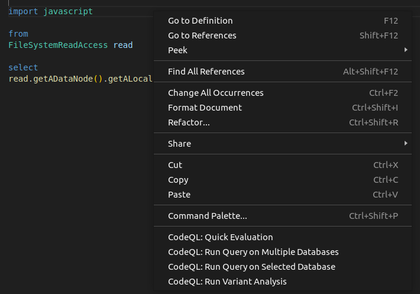

# UntrustIDE

UntrustIDE is our work on exploiting weaknesses in VS Code extensions.

We identified a total of 716 dangerous data flows in extensions.

We verified 21 extension vulnerabilities with PoC exploits for code injection, impacting more than **6 million installations**.

Extension developers and GitHub were notified of our results.

## Research paper for our work

[UntrustIDE: Exploiting Weaknesses in VS Code Extensions](https://www.ndss-symposium.org/ndss-paper/untrustide-exploiting-weaknesses-in-vs-code-extensions/)
 @ *NDSS Symposium 2024*

## What is in this repo?

This is a modified copy of the [vscode-codeql-starter repository](https://github.com/github/vscode-codeql-starter/).

The repo includes
- Example queries to identify sources and sinks, visit [queries/source-and-sink](./queries/source-and-sink/)
- A set of CodeQL rules for identifying VS Code extension vulnerabilities, visit [queries/dataflow](./queries/dataflow/).  
For more on how the dataflow queries work, visit [dataflow docs](./queries/dataflow/README.md)
- sample CodeQL databases at [sample-data](./sample-data/) to test the queries on
- The [ql](./ql) folder contains libraries in order for the CodeQL queries to function properly

## Requirements

Install Visual Studio Code, download [here](https://code.visualstudio.com/download)

To run these queries, set up the [VS Code extension for CodeQL](https://codeql.github.com/docs/codeql-for-visual-studio-code/setting-up-codeql-in-visual-studio-code/).  
If the CLI interface is preferred, install [CodeQL](https://codeql.github.com/) and set up the [CodeQL CLI](https://docs.github.com/en/code-security/codeql-cli/getting-started-with-the-codeql-cli/setting-up-the-codeql-cli).

Have a VS Code extension source code, sample data is provided in subdirectory [sample-data](./sample-data/)

## Quickstart

### Building CodeQL Databases

Sample databases are provided: [sample-data](./sample-data/).

If you wish to run it on other extensions, download the source code and build the source code into CodeQL databases by running the following [command](https://docs.github.com/en/code-security/codeql-cli/codeql-cli-manual/database-create) in the source code directory. (CodeQL CLI required)  
`codeql database create <database-output-directory> --language=javascript`

### Running Queries With the VS Code CodeQL extension  

0. Open this repo in VS Code, this will ensure all required libraries of CodeQL are accessible for the queries to execute successfully.

1. Load database  
Select `From a folder` and choose from the databases provided in [sample-data](./sample-data)  

2. Select database (the checkmark indicates database is selected)   

3. In VS Code, right-click on query file or open a query file and right-click.
Select option `CodeQL: Run Query on Selected Database` to run the query.   

Results will display in VS Code.

