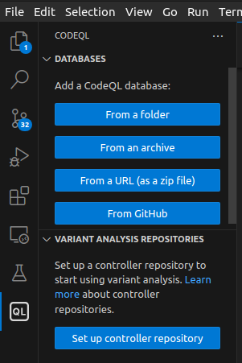
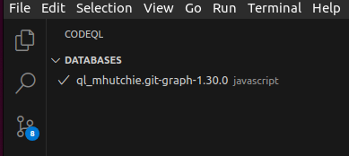
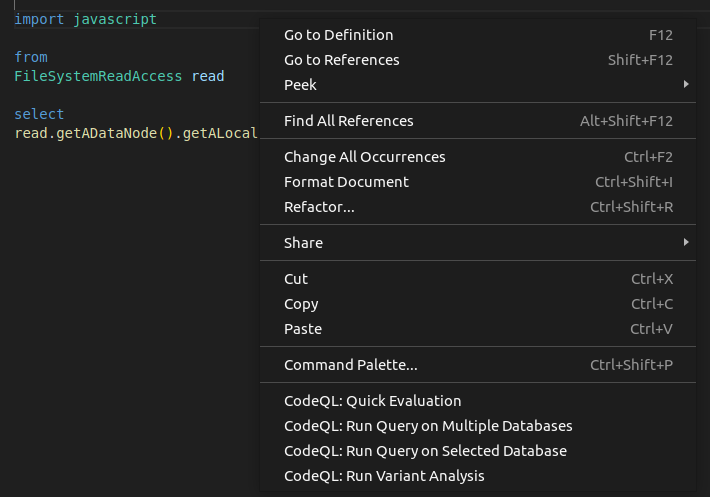

# UntrustIDE

## Introduction

This is a modified copy of the [vscode-codeql-starter repository](https://github.com/github/vscode-codeql-starter/).

The repo includes
- Example queries to identify sources and sinks, visit [source-and-sink](./codeql-custom-queries-javascript/source-and-sink/)
- A set of CodeQL rules for identifying VS Code extension vulnerabilities, visit [dataflow](./codeql-custom-queries-javascript/dataflow/).  
For more on how the dataflow queries work, visit [dataflow docs](./codeql-custom-queries-javascript/dataflow/README.md)

## Requirements

To run these queries, set up the [VS Code extension for CodeQL](https://codeql.github.com/docs/codeql-for-visual-studio-code/setting-up-codeql-in-visual-studio-code/).  
If the CLI interface is preferred, install [CodeQL](https://codeql.github.com/) and set up the [CodeQL CLI](https://docs.github.com/en/code-security/codeql-cli/getting-started-with-the-codeql-cli/setting-up-the-codeql-cli).

Have a VS Code extension source code, sample data is provided in subdirectory [sample-data](./sample-data/)

## Quickstart

### Building CodeQL Databases

A sample database is provided: [sample](./sample-data/git-graph-extension-codeql-database/).

If you wish to run it on other extensions, download the source code and build the source code into CodeQL databases by running the following [command](https://docs.github.com/en/code-security/codeql-cli/codeql-cli-manual/database-create) in the source code directory. (CodeQL CLI required)  
`codeql database create <database-output-directory> --language=javascript`

### Running Queries

There are two ways to run the CodeQL queries:

#### With CodeQL CLI  
Run the following [command](https://docs.github.com/en/code-security/codeql-cli/codeql-cli-manual/database-analyze).  
`codeql database analyze <database-directory> --format=<output-format> --output=<output-filepath> --timeout=<timelimit> <query-path>`

Results will be in outputted file.

#### With VS Code CodeQL extension  

0. Open this repo in VS Code.

1. Load database  

2. Select database (the checkmark indicates database is selected)  

3. In VS Code, right-click on query file or open a query file and right-click.
Select option `CodeQL: Run Query on Selected Database` to run the query.   

Results will display in VS Code.

